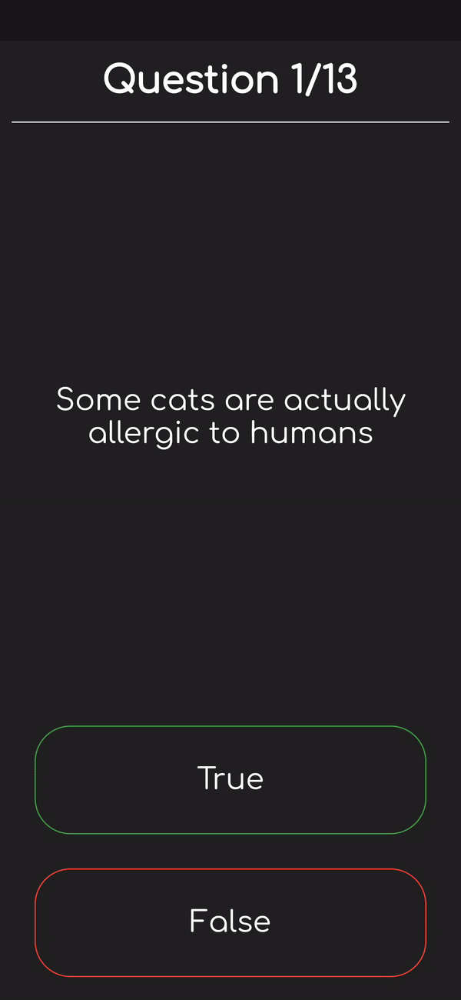

# Quiz_App
A simple quiz app which returns score at the end. Developed this application as a learning task for Object Oriented Programming using Flutter. This app covers all concepts of OOPs i.e Abstraction, Encapsulation, Inheritance and Polymorphism.

## Screenshot

